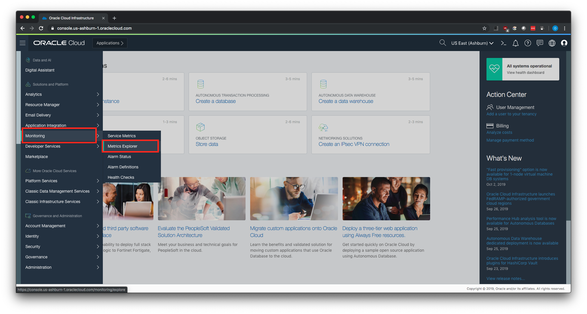
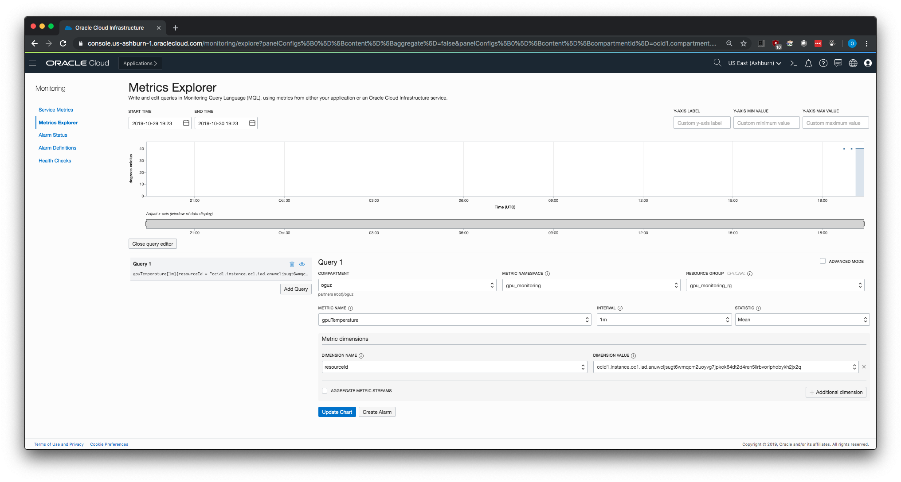
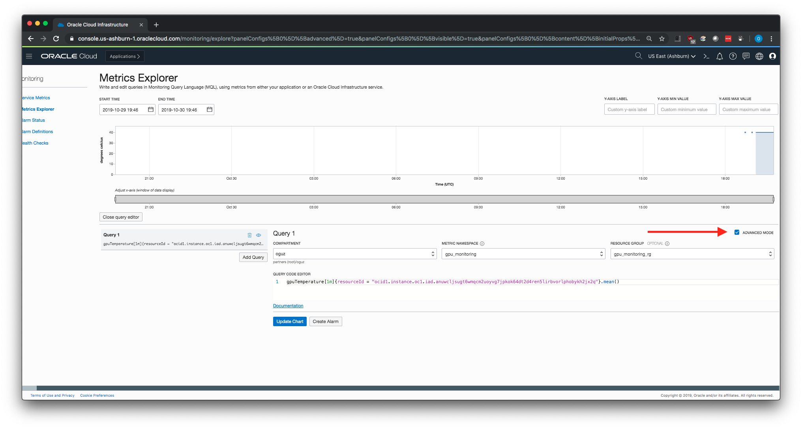

# Publishing GPU metrics to Oracle Cloud Infrastructure (OCI) Monitoring service

Currently, the Oracle Cloud Infrastructure (OCI) [Monitoring service](https://docs.cloud.oracle.com/iaas/Content/Monitoring/Concepts/monitoringoverview.htm) does not have built-in support for collecting GPU metrics from GPU instances.

However, it's possible to publish custom metrics to OCI Monitoring service. This repo has the necessary information and the script for publishing GPU temperature, GPU utilization, and GPU memory utilization from GPU instances to OCI Monitoring service.

If you have any problems, feel free to create an [issue](https://github.com/OguzPastirmaci/oci-gpu-monitoring/issues).

## Prerequisites

### IAM Policy
The script publishes the metrics to the same compartment as the GPU instance being monitored by default. You probably have the necessary IAM policy already configured for your user.

If you plan to use a separate compartment for publishing the metrics, or if you get a message that you don’t have permission or are unauthorized, check with your administrator.

You can find more info in [this link](https://docs.cloud.oracle.com/iaas/Content/Identity/Concepts/commonpolicies.htm#metrics-publish).


### OCI CLI
The script uses OCI CLI for uploading the metrics to OCI Monitoring service, so the CLI must be installed in the GPU instance that you want to monitor.

You can install the OCI CLI by running the following command:

```sh
bash -c "$(curl -L https://raw.githubusercontent.com/oracle/oci-cli/master/scripts/install/install.sh)"
```
**IMPORTANT:** If you change the default installation location of the CLI, or use Ubuntu as the OS, make sure you update the `cliLocation` variable in the shell script.

```sh
# OCI CLI binary location
# Default installation location for Oracle Linux and CentOS is /home/opc/bin/oci
# Default installation location for Ubuntu is /home/ubuntu/bin/oci
cliLocation="/home/opc/bin/oci"
```

To have the CLI walk you through the first-time setup process, use the `oci setup config` command. The command prompts you for the information required for the config file and the API public/private keys. The setup dialog generates an API key pair and creates the config file.


You can find more information on OCI CLI in [this link](https://docs.cloud.oracle.com/iaas/Content/API/Concepts/cliconcepts.htm).

### NVIDIA System Management Interface (nvidia-smi)
The script uses `nvidia-smi` command line utility to gather metrics data from the GPUs in the instance. If you are already using your GPU instances you should already have  the appropriate NVIDIA drivers installed. The script also checks if it's installed but you may SSH into your GPU instance and run `nvidia-smi` in the command line. You should see an output like this:

```console
[opc@gputest ~]$ nvidia-smi

Wed Oct 30 18:29:24 2019
+-----------------------------------------------------------------------------+
| NVIDIA-SMI 418.67       Driver Version: 418.67       CUDA Version: 10.1     |
|-------------------------------+----------------------+----------------------+
| GPU  Name        Persistence-M| Bus-Id        Disp.A | Volatile Uncorr. ECC |
| Fan  Temp  Perf  Pwr:Usage/Cap|         Memory-Usage | GPU-Util  Compute M. |
|===============================+======================+======================|
|   0  Tesla V100-SXM2...  Off  | 00000000:00:04.0 Off |                    0 |
| N/A   38C    P0    39W / 300W |      0MiB / 16130MiB |      0%      Default |
+-------------------------------+----------------------+----------------------+

+-----------------------------------------------------------------------------+
| Processes:                                                       GPU Memory |
|  GPU       PID   Type   Process name                             Usage      |
|=============================================================================|
|  No running processes found                                                 |
+-----------------------------------------------------------------------------+
```

## Steps for publishing GPU metrics to OCI Monitoring service

1. Install git

**Oracle Linux / CentOS**
```sh
sudo yum install -y git
```

**Ubuntu**
```sh
sudo apt-get install -y git
```

1. Clone the repository
```sh
git clone https://github.com/OguzPastirmaci/oci-gpu-monitoring.git
```

3. Change to the repo directory
```sh
cd oci-gpu-monitoring
```

4. We will create a Cron job to run the script every minute, but before that let's run the script manually to check we don't get any errors.

```sh
sh ./publishGPUMetrics.sh
```

5. By default, the scripts writes logs to `/tmp/gpuMetrics.log`. Let's check the logs to see if there were any errors. You should see a log similar to following if there was no errors.

```sh
[opc@gputest oci-gpu-monitoring]$ cat /tmp/gpuMetrics.log

Wed Oct 30 18:58:24 GMT 2019
{
  "data": {
    "failed-metrics": [],
    "failed-metrics-count": 0
  }
}
```

6. Now let's create a Cron job so the script runs regularly. In the below example, I will run the script every minute but you can change the frequency of the Cron job if you need to.

Open the crontab file:
```sh
crontab -e
```

7. Add the following line then save and quit:

**Oracle Linux / CentOS**
```sh
* * * * * sh /home/opc/oci-gpu-monitoring/publishGPUMetrics.sh
```

**Ubuntu**
```sh
* * * * * sh /home/ubuntu/oci-gpu-monitoring/publishGPUMetrics.sh
```

**IMPORTANT**: If you change the script location, update the above command with the new location.

8. Check the Cron jobs list to make sure our job is there
```sh
crontab -l
```

You should see the following line (or similar to it if you changed the location of the script) in the list of jobs:

```sh
[opc@gputest oci-gpu-monitoring]$ crontab -l

* * * * * sh /home/opc/oci-gpu-monitoring/publishGPUMetrics.sh
```

9. Wait a couple of minutes for the script to run and publish the metrics. Then login to OCI console and check if our metrics are being published to OCI Monitoring service. After you login, go to **Monitoring > Metrics Explorer**.



10. In Metrics Explorer, select the following values and click on **Update Chart** in the bottom.

**Compartment:** Name of the compartment that you publish your metrics. Default value is the same compartment with the GPU instance being monitored. You can configure it in the shell script by changing the `compartmentId` variable.

**Metric Namespace:** Default value is `gpu_monitoring`. You can configure it in the shell script by changing the `metricNamespace` variable.

**Resource Group:** Default value is `gpu_monitoring_rg`. You can configure it in the shell script by changing the `metricResourceGroup` variable.

**Metric Name**: Default values are `gpuMemoryUtilization`, `gpuTemperature`, and `gpuUtilization`. Let's choose `gpuTemperature` so we can see some non-zero data.

**Interval:** Default value is `1m`. Select any value in the console that suits your needs.

**Statistic:** Default value is `Mean`. Select any value in the console that suits your needs.

**Dimension Name:** You can choose either `resourceId` or `instanceName`. `resourceId` is the OCID of the GPU instance, and `instanceName` is the display name of the GPU instance.


11. You should be seeing some values in the chart now.



12. Instead of selecting the values from the fields in the console, you may also use the **Query Code Editor** by checking the `Advanced Mode` box. For example, here's the query to get the same chart as above:

```console
gpuTemperature[1m]{resourceId = "ocid1.instance.oc1.iad.anuwcljsugt6wmqcm2uoyvg7jpkok64dt2d4ren5lirbvorlphobykh2jx2q"}.mean()
```


Visit this link to get more info on [Monitoring Query Language (MQL)](https://docs.cloud.oracle.com/iaas/Content/Monitoring/Reference/mql.htm).