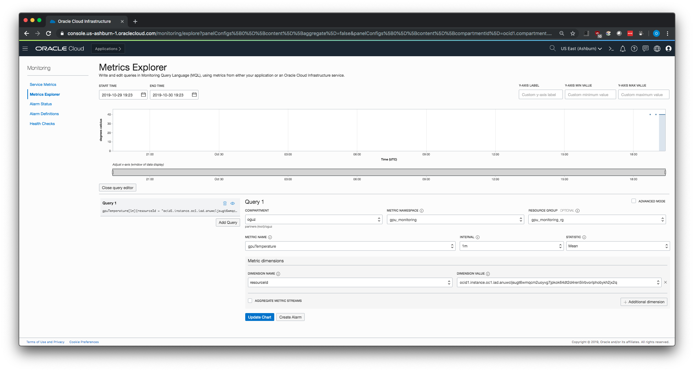
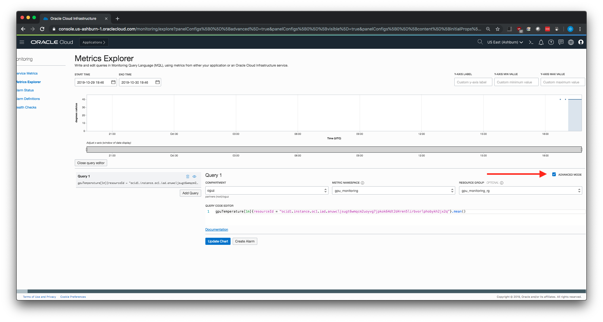

# Step by step instructions for Linux

## Prerequisites

### IAM Policy
The script publishes the metrics to the same compartment as the GPU instance being monitored by default. You probably have the necessary IAM policy already configured for your user.

If you plan to use a separate compartment for publishing the metrics, or if you get a message that you don’t have permission or are unauthorized, check with your tenancy administrator.

You can find more info on policies in [this link](https://docs.cloud.oracle.com/iaas/Content/Identity/Concepts/commonpolicies.htm#metrics-publish).

### OCI CLI
The script uses OCI CLI for uploading the metrics to OCI Monitoring service, so the CLI must be installed in the GPU instances that you want to monitor.

You can install the OCI CLI by running the following command:

```sh
bash -c "$(curl -L https://raw.githubusercontent.com/oracle/oci-cli/master/scripts/install/install.sh)"
```

**IMPORTANT:** If you change the default installation location of the CLI, or use Ubuntu as the OS, make sure you update the `cliLocation` variable in the shell script.

```sh
# OCI CLI binary location
# Default installation location for Oracle Linux 7 is /home/opc/bin/oci
# Default installation location for Ubuntu 18.04 and Ubuntu 16.04 is /home/ubuntu/bin/oci
cliLocation="/home/opc/bin/oci"
```

To have the CLI walk you through the first-time setup process, use the `oci setup config` command. The command prompts you for the information required for the config file and the API public/private keys. The setup dialog generates an API key pair and creates the config file.

You can find more information on OCI CLI in [this link](https://docs.cloud.oracle.com/iaas/Content/API/Concepts/cliconcepts.htm).

### NVIDIA System Management Interface (nvidia-smi)
The script uses `nvidia-smi` command line utility to gather metrics data from the GPUs in the instance. If you are already using your GPU instances for running GPU workloads, you most likely already have the appropriate NVIDIA drivers installed. The script checks if it's installed, but you may SSH into your GPU instance and run `nvidia-smi` in the command line. You should see an output like this:

```console
[opc@gputest ~]$ nvidia-smi

Wed Oct 30 18:29:24 2019
+-----------------------------------------------------------------------------+
| NVIDIA-SMI 418.67       Driver Version: 418.67       CUDA Version: 10.1     |
|-------------------------------+----------------------+----------------------+
| GPU  Name        Persistence-M| Bus-Id        Disp.A | Volatile Uncorr. ECC |
| Fan  Temp  Perf  Pwr:Usage/Cap|         Memory-Usage | GPU-Util  Compute M. |
|===============================+======================+======================|
|   0  Tesla V100-SXM2...  Off  | 00000000:00:04.0 Off |                    0 |
| N/A   38C    P0    39W / 300W |      0MiB / 16130MiB |      0%      Default |
+-------------------------------+----------------------+----------------------+

+-----------------------------------------------------------------------------+
| Processes:                                                       GPU Memory |
|  GPU       PID   Type   Process name                             Usage      |
|=============================================================================|
|  No running processes found                                                 |
+-----------------------------------------------------------------------------+
```

## Steps for publishing GPU metrics to OCI Monitoring service

1. Install git & jq

**Oracle Linux 7**
```sh
sudo yum install -y git jq
```

**Ubuntu**
```sh
sudo apt-get install -y git jq
```

2. Clone this repository
```sh
git clone https://github.com/OguzPastirmaci/oci-gpu-monitoring.git
```

3. Change to the scripts directory
```sh
cd oci-gpu-monitoring/scripts
```

4. We will create a Cron job to run the script every minute, but before that let's run the script manually to check that we don't get any errors.

```sh
sudo chmod +x publishGPUMetrics.sh
./publishGPUMetrics.sh
```

5. By default, the script writes logs to `/tmp/gpuMetrics.log`. Check the logs to see if there were any errors. You should see a log similar to following if the script has run successfully.

```sh
[opc@gputest scripts]$ cat /tmp/gpuMetrics.log

Wed Oct 30 18:58:24 GMT 2019
{
  "data": {
    "failed-metrics": [],
    "failed-metrics-count": 0
  }
}
```

6. If you don't see any errors in the logs, let's create a Cron job so the script runs automatically. The example job below runs the script every minute, but you can change the frequency of the Cron job depending on your needs. Custom metrics can be posted as frequently as every second (minimum frequency of one second), but the minimum aggregation interval is one minute.

Open the crontab file:
```sh
crontab -e
```

7. Add the following line then save the file:

**IMPORTANT**: If you have changed the script location, update the below commands with the new location.

**Oracle Linux 7**
```sh
* * * * * bash /home/opc/oci-gpu-monitoring/scripts/publishGPUMetrics.sh
```

**Ubuntu 16.04 / Ubuntu 18.04**
```sh
* * * * * bash /home/ubuntu/oci-gpu-monitoring/scripts/publishGPUMetrics.sh
```

8. Check the Cron jobs list to make sure the job is listed:
```sh
crontab -l
```

You should see the following line (or similar to it if you have changed the location of the script) in the list of jobs:

```sh
[opc@gputest oci-gpu-monitoring]$ crontab -l

* * * * * bash /home/opc/oci-gpu-monitoring/scripts/publishGPUMetrics.sh
```

9. Wait for a couple of minutes for the script to run and publish the metrics. Then login to OCI console and check if the metrics are available in OCI Monitoring service. After you login to the console, go to **Observability & Management > Monitoring > Metrics Explorer**.

10. In Metrics Explorer, select the following values and click on **Update Chart** in the bottom.

**Compartment:** Name of the compartment that you publish the metrics. Default value is the same compartment with the GPU instance being monitored. You can configure it in the shell script by changing the value of `compartmentId` variable.

**Metric Namespace:** Default value is `gpu_monitoring`. You can configure it in the shell script by changing the value of `metricNamespace` variable.

**Resource Group:** Default value is `gpu_monitoring_rg`. You can configure it in the shell script by changing the value of `metricResourceGroup` variable.

**Metric Name**: Default values are `gpuMemoryUtilization`, `gpuTemperature`, and `gpuUtilization`. Let's choose `gpuTemperature` so we can see some non-zero data.

**Interval:** Default value is `1m`. Select any value in the console that suits your needs. While custom metrics can be posted as frequently as every second (minimum frequency of one second), the minimum aggregation interval is one minute.

**Statistic:** Default value is `Mean`. Select any value in the console that suits your needs.

**Dimension Name:** You can choose either `resourceId` or `instanceName`. `resourceId` is the OCID of the GPU instance, and `instanceName` is the display name of the GPU instance.


11. You should be seeing some values in the chart now.



12. Instead of selecting the values from the fields in the console, you may also use the **Query Code Editor** by checking the **Advanced Mode** box. For example, here's the query to get the same chart as above:

```console
gpuTemperature[1m]{resourceId = "ocid1.instance.oc1.iad.anuwcljsugt6wmqcm2uoyvg7jpkok64dt2d4ren5lirbvorlphobykh2jx2q"}.mean()
```


Visit this link to get more info on [Monitoring Query Language (MQL)](https://docs.cloud.oracle.com/iaas/Content/Monitoring/Reference/mql.htm).


## FAQ
1. Are there any other GPU metrics available besides GPU temperature, GPU utilization, and GPU memory utilization?
   
The script uses `nvidia-smi` to get the metrics and then converts the data to OCI Monitoring compatible json. So any metric available in `nvidia-smi` can be published to OCI Monitoring service.

You can get a complete list of the query arguments by running:

```sh
nvidia-smi --help-query-gpu
```

For example, let's say you want to publish total free memory of the GPU. You can add the following variable to the script:

```sh
gpuFreeMemory=$(nvidia-smi --query-gpu=memory.free --format=csv,noheader,nounits)
```

Then add a new block in the json payload in the script that is sent to OCI Monitoring service.

```json
   {
      "namespace":"$metricNamespace",
      "compartmentId":"$compartmentId",
      "resourceGroup":"$metricResourceGroup",
      "name":"gpuFreeMemory",
      "dimensions":{
         "resourceId":"$instanceId",
         "instanceName":"$instanceName"
      },
      "metadata":{
         "unit":"MiB",
         "displayName":"Total free memory"
      },
      "datapoints":[
         {
            "timestamp":"$gpuTimestamp",
            "value":$gpuFreeMemory
         }
      ]
   }
```
