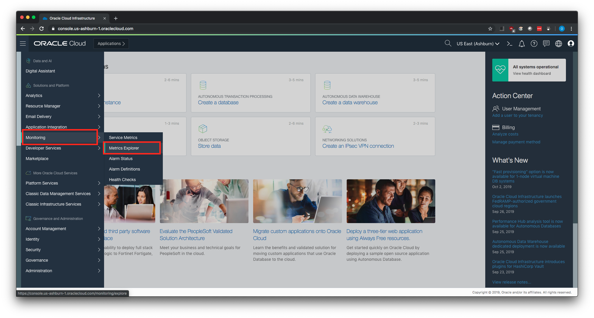

# Step by step instructions for Windows

## Prerequisites

### IAM Policy
The script publishes the metrics to the same compartment as the GPU instance being monitored by default. You probably have the necessary IAM policy already configured for your user.

If you plan to use a separate compartment for publishing the metrics, or if you get a message that you don’t have permission or are unauthorized, check with your tenancy administrator.

You can find more info on policies in [this link](https://docs.cloud.oracle.com/iaas/Content/Identity/Concepts/commonpolicies.htm#metrics-publish).


### OCI CLI
The script uses OCI CLI for uploading the metrics to OCI Monitoring service, so the CLI must be installed in the GPU instances that you want to monitor.

You can install the OCI CLI by running the following command:

```sh
powershell -NoProfile -ExecutionPolicy Bypass -Command "iex ((New-Object System.Net.WebClient).DownloadString('https://raw.githubusercontent.com/oracle/oci-cli/master/scripts/install/install.ps1'))"
```

**IMPORTANT:** If you change the default installation location of the CLI, or use Ubuntu as the OS, make sure you update the `cliLocation` variable in the shell script.

```sh
# OCI CLI binary location
# Default installation location is "C:\Users\opc\bin"
$cliLocation = "C:\Users\opc\bin"
```

To have the CLI walk you through the first-time setup process, use the `oci setup config` command. The command prompts you for the information required for the config file and the API public/private keys. The setup dialog generates an API key pair and creates the config file.

You can find more information on OCI CLI in [this link](https://docs.cloud.oracle.com/iaas/Content/API/Concepts/cliconcepts.htm).

### NVIDIA System Management Interface (nvidia-smi)
The script uses `nvidia-smi` command line utility to gather metrics data from the GPUs in the instance. If you are already using your GPU instances for running GPU workloads, you most likely already have the appropriate NVIDIA drivers installed. The default installation directory for `nvidia-smi` is `C:\Program Files\NVIDIA Corporation\NVSMI`.

The script checks if it's installed and in your path, but you may RDP into your GPU instance and run `nvidia-smi` in the command line. You should see an output like this:

```sh
# nvidia-smi binary location
# Default installation location is "C:\Program Files\NVIDIA Corporation\NVSMI"
$nvidiaSmiLocation = "C:\Program Files\NVIDIA Corporation\NVSMI"
```

```console
PS C:\Users\opc> nvidia-smi.exe

Thu Nov 07 21:05:43 2019       
+-----------------------------------------------------------------------------+
| NVIDIA-SMI 426.23       Driver Version: 426.23       CUDA Version: 10.1     |
|-------------------------------+----------------------+----------------------+
| GPU  Name            TCC/WDDM | Bus-Id        Disp.A | Volatile Uncorr. ECC |
| Fan  Temp  Perf  Pwr:Usage/Cap|         Memory-Usage | GPU-Util  Compute M. |
|===============================+======================+======================|
|   0  Tesla V100-SXM2...  TCC  | 00000000:00:04.0 Off |                    0 |
| N/A   34C    P0    22W / 300W |      0MiB / 16258MiB |      0%      Default |
+-------------------------------+----------------------+----------------------+
                                                                               
+-----------------------------------------------------------------------------+
| Processes:                                                       GPU Memory |
|  GPU       PID   Type   Process name                             Usage      |
|=============================================================================|
|  No running processes found                                                 |
+-----------------------------------------------------------------------------+ 
```

## Steps for publishing GPU metrics to OCI Monitoring service

1. Create a directory in your user's home directory.
   
```sh
New-Item -Name "oci-gpu-monitoring" -Path $Home -ItemType Directory 
```

2. Download the script from GitHub.

```sh
Invoke-WebRequest -Uri "https://raw.githubusercontent.com/OguzPastirmaci/oci-gpu-monitoring/master/publishGPUMetrics.ps1" -OutFile "$Home\oci-gpu-monitoring\publishGPUMetrics.ps1"
 ```

3. Unblock the script so you could run it.
```sh
Unblock-File "$Home\oci-gpu-monitoring\publishGPUMetrics.ps1" 
```

4. Change to the directory.
```sh
cd "$Home\oci-gpu-monitoring"
```

5. We will create a scheduled task to run the script every minute and wrote logs to `$Home\oci-gpu-monitoring\gpuMetrics.log`, but before that let's run the script manually to check that we don't get any errors.

```sh
 .\publishGPUMetrics.ps1 
```

6. You should see an output similar to following if the script has run successfully.

```sh
PS C:\Users\opc\oci-gpu-monitoring> .\publishGPUMetrics.ps1

Thursday, November 7, 2019 11:25:51 PM
{
  "data": {
    "failed-metrics": [],
    "failed-metrics-count": 0
  }
} 
```

7. If you don't see any errors in the output, let's create a scheduled task so the script runs automatically. The example job below runs the script every minute, but you can change the frequency of the scheduled task depending on your needs. Custom metrics can be posted as frequently as every second (minimum frequency of one second), but the minimum aggregation interval is one minute.

The below script will create a scheduled task. You may also create it using the Task Scheduler UI.
```sh
  # Name of the scheduled task
$taskName = "oci-gpu-monitoring"

# Script and log location defaults. Change if you need to.
$scriptLocation = "$Home\oci-gpu-monitoring\publishGPUMetrics.ps1"
$logLocation = "$Home\oci-gpu-monitoring\gpuMetrics.log"
$script =  "$scriptLocation 2>&1 > $logLocation"

# Running frequency
$frequency = (New-TimeSpan -Minutes 1)

$action = New-ScheduledTaskAction –Execute "$pshome\powershell.exe" -Argument "$script; quit"
$trigger = New-ScheduledTaskTrigger -Once -At (Get-Date).Date -RepetitionInterval $frequency

# The script will ask for username & password that will run the task 
$msg = "Enter the username and password that will run the task"; 
$credential = $Host.UI.PromptForCredential("Task username and password",$msg,"$env:userdomain\$env:username",$env:userdomain)
$username = $credential.UserName
$password = $credential.GetNetworkCredential().Password
$settings = New-ScheduledTaskSettingsSet -StartWhenAvailable -RunOnlyIfNetworkAvailable -DontStopOnIdleEnd
 
Register-ScheduledTask -TaskName $jobname -Action $action -Trigger $trigger -RunLevel Highest -User $username -Password $password -Settings $settings
 ```

8. Let's check if we see the task in Task Scheduler. Run `taskschd.msc` in a PowerShell to open Task Scheduler and you should see a task with the name you created in the previous step.


9.  Wait for a couple of minutes for the script to run and publish the metrics. Then login to OCI console and check if the metrics are available in OCI Monitoring service. After you login to the console, go to **Monitoring > Metrics Explorer**.



10. In Metrics Explorer, select the following values and click on **Update Chart** in the bottom.

**Compartment:** Name of the compartment that you publish the metrics. Default value is the same compartment with the GPU instance being monitored. You can configure it in the shell script by changing the value of `compartmentId` variable.

**Metric Namespace:** Default value is `gpu_monitoring`. You can configure it in the shell script by changing the value of `metricNamespace` variable.

**Resource Group:** Default value is `gpu_monitoring_rg`. You can configure it in the shell script by changing the value of `metricResourceGroup` variable.

**Metric Name**: Default values are `gpuMemoryUtilization`, `gpuTemperature`, and `gpuUtilization`. Let's choose `gpuTemperature` so we can see some non-zero data.

**Interval:** Default value is `1m`. Select any value in the console that suits your needs. While custom metrics can be posted as frequently as every second (minimum frequency of one second), the minimum aggregation interval is one minute.

**Statistic:** Default value is `Mean`. Select any value in the console that suits your needs.

**Dimension Name:** You can choose either `resourceId` or `instanceName`. `resourceId` is the OCID of the GPU instance, and `instanceName` is the display name of the GPU instance.


11. You should be seeing some values in the chart now.


12. Instead of selecting the values from the fields in the console, you may also use the **Query Code Editor** by checking the **Advanced Mode** box. For example, here's the query to get the same chart as above:

```console
gpuTemperature[1m]{resourceId = "ocid1.instance.oc1.iad.anuwcljsugt6wmqcm2uoyvg7jpkok64dt2d4ren5lirbvorlphobykh2jx2q"}.mean()
```


Visit this link to get more info on [Monitoring Query Language (MQL)](https://docs.cloud.oracle.com/iaas/Content/Monitoring/Reference/mql.htm).


## FAQ
1. Are there any other GPU metrics available besides GPU temperature, GPU utilization, and GPU memory utilization?
   
The script uses `nvidia-smi` to get the metrics and then converts the data to OCI Monitoring compatible json. So any metric available in `nvidia-smi` can be published to OCI Monitoring service.

You can get a complete list of the query arguments by running:

```sh
nvidia-smi.exe --help-query-gpu
```

For example, let's say you want to publish total free memory of the GPU. You can add the following variable to the script:

```sh
$gpuFreeMemory = $(nvidia-smi --query-gpu=memory.free --format=csv,noheader,nounits)
```

Then add a new block in the json payload in the script that is sent to OCI Monitoring service.

```json
   {
      "namespace":"$metricNamespace",
      "compartmentId":"$compartmentId",
      "resourceGroup":"$metricResourceGroup",
      "name":"gpuFreeMemory",
      "dimensions":{
         "resourceId":"$instanceId",
         "instanceName":"$instanceName"
      },
      "metadata":{
         "unit":"MiB",
         "displayName":"Total free memory"
      },
      "datapoints":[
         {
            "timestamp":"$gpuTimestamp",
            "value":$gpuFreeMemory
         }
      ]
   }
```